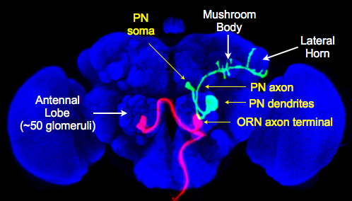

To make own website, would be best to find an rmarkdown website that you really like and copy it. 

# Neural Circuits and Behaviour {#research-background}

  We study how the **structure** of brain circuits *relates* to behavioural **output**. 
  
  Geosmin as an example of a labelled line [@huoviala2018neural].
  
  
# Innate circuitry

  The lateral horn
  

## Images




## Tables

Better to include as images, because the only way to make tables in markdown, you have to write it out explicitly;

| Column 1 | Column 2|
|----------|---------|
|     1    |    2    |
|     3    |    4    |
|     5    |    6    |


## Blocks of code

```

Library(tidyverse)

```

\


# References


